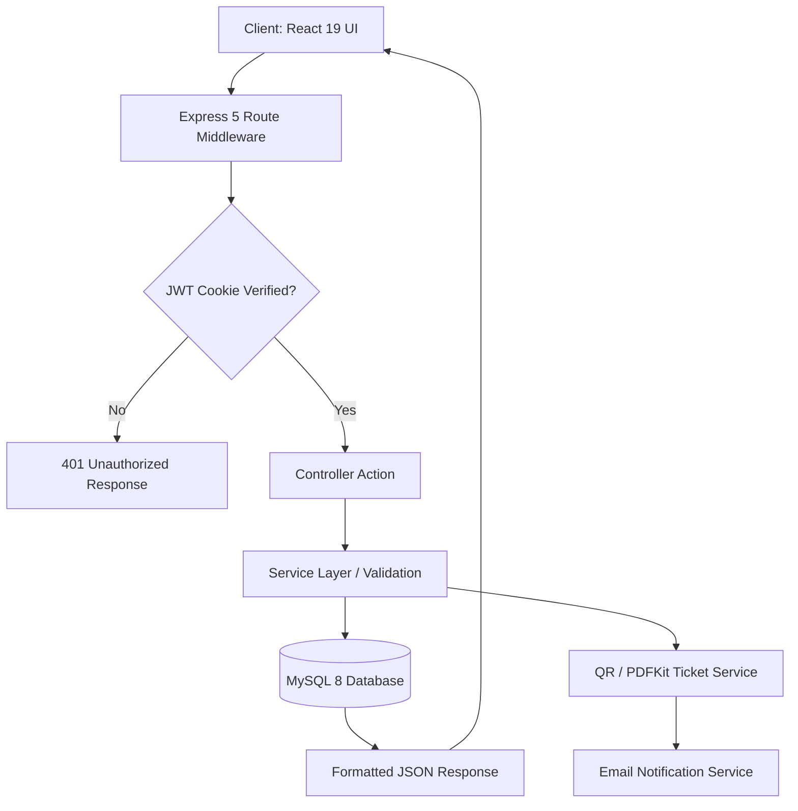

<div align="center">

# CampusHub

**Full-stack campus administration platform unifying event registrations, club communities, lost-and-found tracking, and role-based portals.**

[](LICENSE)
[](https://react.dev)
[](https://expressjs.com)
[](https://www.mysql.com)
[](https://vitejs.dev)

[Report Bug](https://github.com/Justinvcj/CampusHub/issues) · [Request Feature](https://github.com/Justinvcj/CampusHub/issues)

</div>

---

```
┌─────────────────────────────────────────────────────────────────────────────┐
│                            CampusHub Platform                               │
│                                                                             │
│  ┌────────────────────┐  ┌────────────────────┐  ┌───────────────────────┐  │
│  │ Student Dashboard  │  │ Faculty Dashboard  │  │  Admin Control Center │  │
│  │ (Events/Clubs/Lost)│  │ (Approval/Members) │  │  (Audits/System Logs) │  │
│  └─────────┬──────────┘  └─────────┬──────────┘  └───────────┬───────────┘  │
│            │                       │                         │              │
│            ▼                       ▼                         ▼              │
│  ┌───────────────────────────────────────────────────────────────────────┐  │
│  │ Express 5 MVC Core (JWT Cookies • Rate Limiting • QR Tickets • Multer)│  │
│  └───────────────────────────────────┬───────────────────────────────────┘  │
│                                      ▼                                      │
│  ┌───────────────────────────────────────────────────────────────────────┐  │
│  │                  MySQL Relational Persistence Layer                   │  │
│  └───────────────────────────────────────────────────────────────────────┘  │
└─────────────────────────────────────────────────────────────────────────────┘
```

> University communities often juggle disconnected portals for event passes, student clubs, item recovery, and administrative approvals, leading to missed deadlines and fragmented communication.
> CampusHub consolidates student life into a single role-aware platform with automated QR ticket validation, verified club feeds, and comprehensive administrative audit logging.

---

## Features

- **Role-Aware Dashboards** — Delivers custom interfaces and Chart.js analytics tailored for Students, Faculty, and Administrators.
- **Secure Session Management** — Implements JWT access tokens with rotating refresh cookies stored in secure HTTP-only headers.
- **Automated QR Event Ticketing** — Issues digital passes and downloadable PDF tickets equipped with scannable QR verification codes.
- **Interactive Club Communities** — Supports club discovery, membership rosters, announcements, multimedia posts, and comments.
- **Lost & Found Resolution** — Streamlines item reporting with photo attachments, claim verification, and admin resolution workflows.
- **Enterprise Security Middleware** — Hardened with Helmet, strict CORS policies, Express rate limiting, and parameterized SQL queries.

---

## API Architecture

| Method | Endpoint | Access | Description |
|---|---|---|---|
| `POST` | `/api/auth/register` | Public | Register a new user account |
| `POST` | `/api/auth/login` | Public | Authenticate user & issue HTTP-only refresh cookie |
| `POST` | `/api/auth/refresh` | Public | Rotate refresh session & mint new access token |
| `GET` | `/api/events` | Authenticated | List all active campus events with pagination |
| `POST` | `/api/events/:id/register` | Student | Register for an event & generate QR attendance pass |
| `GET` | `/api/events/:id/attendance-qr` | Faculty/Admin | Retrieve master QR code for attendee check-in |
| `POST` | `/api/clubs/:id/join` | Student | Join student club roster |
| `POST` | `/api/lost-found` | Authenticated | Report a lost or found item with image upload |
| `POST` | `/api/lost-found/:id/claim` | Authenticated | Submit an item claim with proof description |
| `GET` | `/api/dashboard/admin` | Admin | Aggregate institutional analytics & audit logs |

---

## How It Works



---

## Quick Start

### Prerequisites

| Requirement | Version | Notes |
|---|---|---|
| [Node.js](https://nodejs.org/) | 18+ | Runtime for client and server |
| [MySQL](https://www.mysql.com/) | 8.0+ | Relational database |
| [npm](https://www.npmjs.com/) | 9+ | Package manager |

### Installation

1. Clone the repository:
   ```bash
   git clone https://github.com/Justinvcj/CampusHub.git
   cd CampusHub
   ```

2. Install dependencies for root and frontend:
   ```bash
   npm install
   npm install --prefix client
   ```

3. Configure environment variables:
   ```bash
   cp .env.example .env
   # Update DB_USER, DB_PASSWORD, and JWT secrets in .env
   ```

4. Seed the database with initial roles and dummy records:
   ```bash
   npm run db:seed
   ```

5. Launch development environment:
   ```bash
   npm run dev
   ```

### Usage

Access the client at `http://localhost:5173` and the API server at `http://localhost:5000`. Log in using seeded test accounts or register a new student account.

---

## Configuration

| Variable | Required | Default | Description |
|---|---|---|---|
| `PORT` | No | `5000` | Backend API server port |
| `CLIENT_URL` | No | `http://localhost:5173` | Frontend client origin for CORS |
| `DB_HOST` | Yes | `localhost` | MySQL database host |
| `DB_PORT` | No | `3306` | MySQL port |
| `DB_USER` | Yes | `root` | Database username |
| `DB_PASSWORD` | Yes | — | Database password |
| `DB_NAME` | Yes | `campushub` | Database schema name |
| `JWT_ACCESS_SECRET` | Yes | — | Secret key for signing short-lived access tokens |
| `JWT_REFRESH_SECRET` | Yes | — | Secret key for signing long-lived refresh tokens |

---

## Tech Stack

| Layer | Technology |
|---|---|
| Frontend | React 19, Vite 8, React Router v7, Tailwind CSS v4, Chart.js, React-ChartJS-2, Lucide React |
| Backend | Node.js, Express 5, MySQL (`mysql2`), JWT, BcryptJS, Cookie-Parser, Multer |
| Utilities | PDFKit, QRCode, Nodemailer, Date-fns, Helmet, Morgan, Express-Rate-Limit |
| Testing | Vitest, Supertest, Oxlint |

---

## Testing

```bash
# Run backend integration tests
npm test
```

---

## Contributing

Contributions are welcome. Please open an issue first to discuss any proposed changes.

1. Fork the Project
2. Create your Feature Branch (`git checkout -b feat/CampusFeature`)
3. Commit your Changes (`git commit -m 'feat: add campus feature'`)
4. Push to the Branch (`git push origin feat/CampusFeature`)
5. Open a Pull Request

---

## License

Distributed under the ISC License. See [package.json](package.json) for details.
