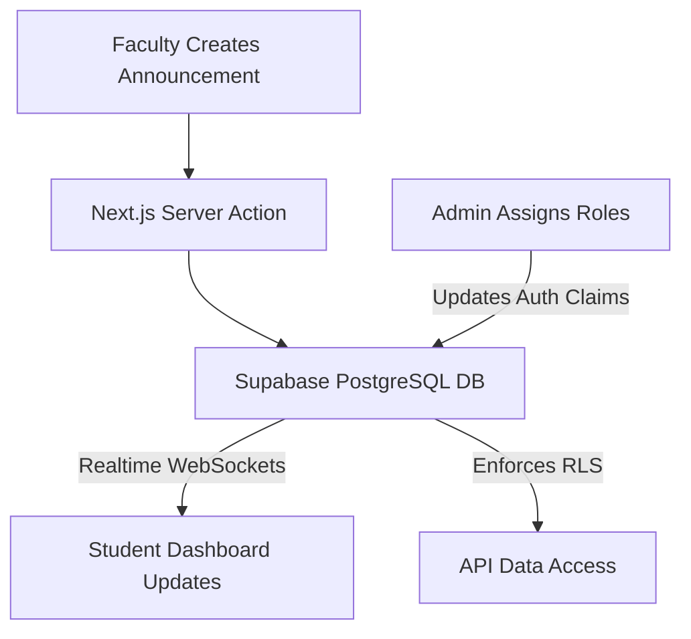

<div align="center">

# CampusHub

**A centralized, real-time communication and resource-sharing platform designed to bridge the gap between students, faculty, and university administration.**

[](LICENSE)
[](https://nextjs.org)
[](https://react.dev)
[](https://supabase.com)
[](https://tailwindcss.com)

[Report Bug](https://github.com/Justinvcj/CampusHub/issues) * [Request Feature](https://github.com/Justinvcj/CampusHub/issues)

</div>

---

```
+-----------------------------------------------------------------------------+
|                      CampusHub Platform Architecture                        |
|                                                                             |
|  +-----------------------+  +-----------------------+  +-----------------+  |
|  | Student Portal        |  | Faculty Dashboard     |  | Admin Console   |  |
|  | (Events/Resources)    |  | (Announcements)       |  | (User Roles)    |  |
|  +----------+------------+  +----------+------------+  +--------+--------+  |
|             |                          |                        |           |
|             +--------------------------+------------------------+           |
|                                        v                                    |
|  +-----------------------------------------------------------------------+  |
|  |     Next.js 14 API Routes * Server Actions * Edge Middleware          |  |
|  +-------------------------------------+---------------------------------+  |
|                                        v                                    |
|  +-----------------------------------------------------------------------+  |
|  |     Supabase Realtime PostgreSQL * Row Level Security (RLS) Auth      |  |
|  +-----------------------------------------------------------------------+  |
+-----------------------------------------------------------------------------+
```

> University campuses suffer from fragmented communication—critical announcements are lost in massive email threads, and study resources are scattered across disconnected platforms.
> CampusHub solves this by providing a unified, real-time Next.js web application that connects the entire campus ecosystem. Powered by Supabase, it ensures secure role-based access control (RBAC) so that faculty can broadcast announcements while students collaborate on shared resources in real-time.

---

## Features

- **Role-Based Access Control (RBAC)** -- Secure, distinct user experiences and permissions for Students, Faculty, and Administrators using Supabase Row Level Security.
- **Real-Time Announcements** -- Faculty can instantly broadcast critical updates and assignments to specific cohorts or the entire campus.
- **Centralized Resource Hub** -- A collaborative repository for sharing lecture notes, study materials, and past papers.
- **Campus Event Board** -- An interactive calendar for discovering, hosting, and RSVPing to club activities and university events.
- **Modern Tech Stack** -- Built on Next.js 14 App Router with Server Actions for optimal performance and SEO.

---

## How It Works



---

## Quick Start

### Prerequisites

| Requirement | Version | Notes |
|---|---|---|
| [Node.js](https://nodejs.org/) | 18+ | JavaScript runtime |
| [npm](https://www.npmjs.com/) | 9+ | Package manager |
| [Supabase](https://supabase.com/) | Cloud / Local | PostgreSQL database and Auth |

### Installation

1. Clone the repository:
   ```bash
   git clone https://github.com/Justinvcj/CampusHub.git
   cd CampusHub
   ```

2. Install dependencies:
   ```bash
   npm install
   ```

3. Configure Environment Variables:
   Create a `.env.local` file in the root directory:
   ```env
   NEXT_PUBLIC_SUPABASE_URL=your_supabase_url
   NEXT_PUBLIC_SUPABASE_ANON_KEY=your_supabase_anon_key
   ```

4. Launch the development server:
   ```bash
   npm run dev
   ```
   Open `http://localhost:3000` to view the application.

---

## Contributing

Contributions are welcome. Please open an issue first to discuss the changes you would like to make.

1. Fork the Project
2. Create your Feature Branch (`git checkout -b feat/AddEventRSVP`)
3. Commit your Changes (`git commit -m 'feat: add RSVP functionality for campus events'`)
4. Push to the Branch (`git push origin feat/AddEventRSVP`)
5. Open a Pull Request

---

## License

Distributed under the MIT License. See [LICENSE](LICENSE) for details.